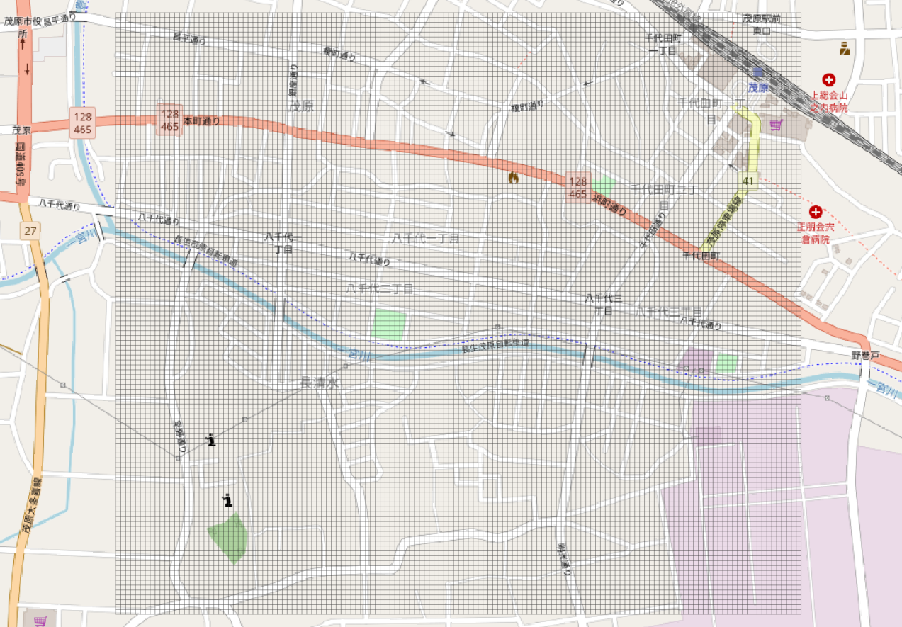
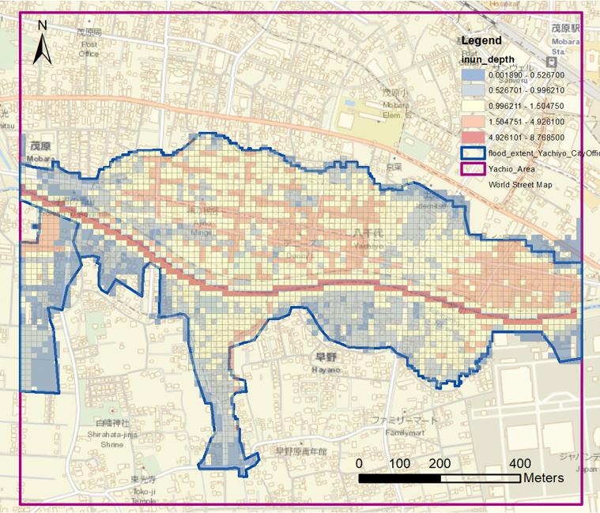
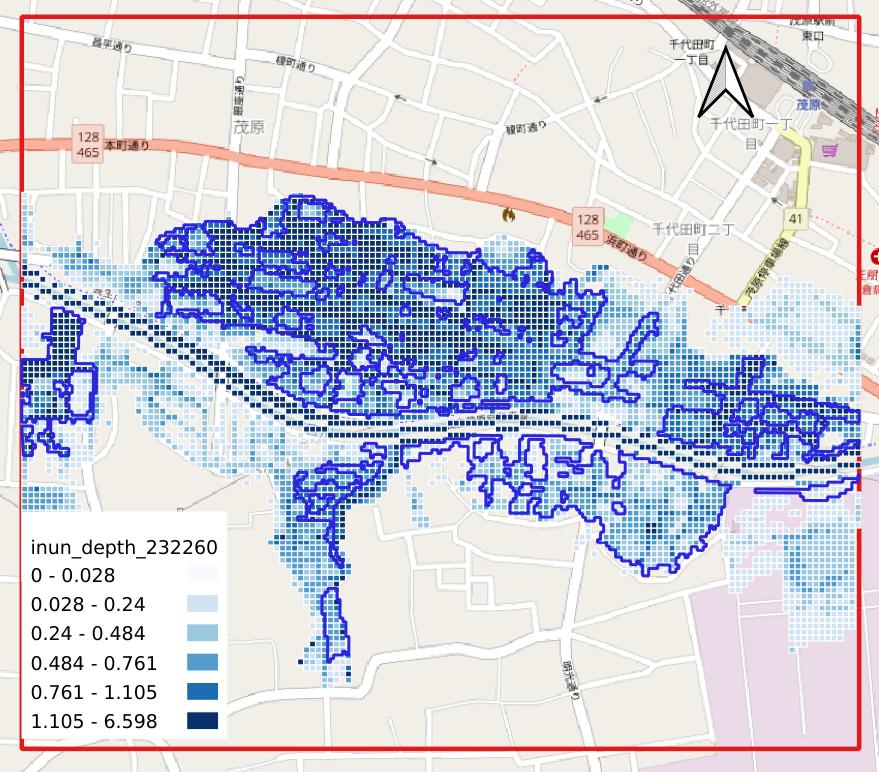
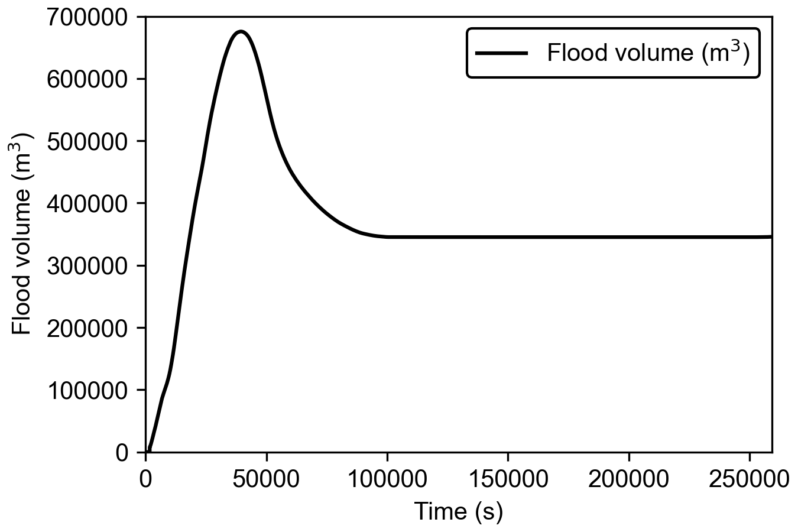

# hydraulicmodel
Flood modeling by 2D shallow water equation. 
Refer to Hunter et al (2005), Bates et al. (2010). 

Please refer to the following paper on the detailed implementation and results. 

```
@Article{ouyang2022employment,
  author  = {Mao Ouyang and Shunji Kotsuki and Yuka Ito and Tomochika Tokunaga},
  journal = {Journal of Hydrology: Regional Studies},
  title   = {Employment of hydraulic model and social media data for flood hazard assessment in an urban city},
  year    = {2022},
  issn    = {2214-5818},
  pages   = {101261},
  volume  = {44},
  doi     = {10.1016/j.ejrh.2022.101261},
}
```

## Diffusive wave approximation


## Local inertail approaximation


## Time steps in two methods

- Diffusive wave approximation


- Local inertial approximation


## Implementation of these two approximations for simulating the flood in Mobara city on October 25, 2019

Setting of the domain and boundary conditions


Results of the maximum inundation area calculated by the diffusive wave approximation, compared with the flood extent reported by Chiba Office


Results of the inundation range considering the flood recession by the local inertial approximation, compared with the flood extent estimated by Geospatial Information Authority of Japan (GSI). 


## Evolution of flood volume

